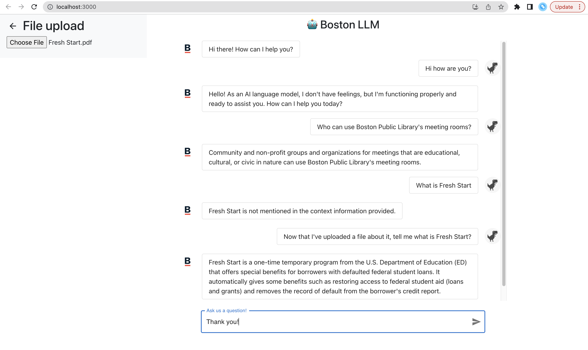

# LLM Prototypes

The current prototype is a conversational chatbot built with langchain's agent framework. We aim to create a chatbot for internal use to help government workers answer public inquiries from Boston residents. The agent is given an array of tools including government data query tool (data indexed into vector store using LlamaIndex, stored and queried in Pinecone), serpapi web search tool, and a ChatGPT plugin. When asked a question, the agent is able to make choices as to which tool to use and explain its thought process in a transparent manner.

Week 1 Progress:

- [x]  On top of the current implementation in Flask, make sure the model runs with multiple file inputs, and potentially with file input of different formats.
- [x]  Build the client side of the application in React, including a real-time chatbot response and moving dots indicating response is generating
- [x]  Explore the use of roles and contexts
    - By helping user create structured queries, the responses may become more accurate
    - user is not allowed to become a GPT freerider by telling bot to “forget about everything and answer this”

Week 2 Progress:

- [x] Implement user feedback system (thumb up/down) on the client side; feedback data, including the current question and chatbot response, are instantly sent to Airtable for analysis.
- [x] Read documentation for langchain, migrate the llamaindex query engine to a langchain agent framework; currently the agent's toolkit only contains llamaindex
- [x] Build frontend file upload portal
- [x] Receive uploaded file on the backend
- [x]  Improve styling of components using Bootstrap or CSS

Week 3 Progress:

- [x] Fix file upload problem by adding storage context so files persist through uploads and is dynamically integrated to llamaindex's indices without the need to restart the server
- [x] Add two more tools to the toolkit: serpapi web search tool and ChatGPT plugin
- [x] Integrate Pinecone vector store
- [x] Refactor code to reflect a clearer code structure; add comments and improve documentations

TODO: 
- [ ] Start document on github wiki
- [ ] Return all thought process on the frontend
- [ ] Explore the potential for text retrieval: return original source text to provide more transparency
- [ ] Add meta data about each file for more accurate and efficient indexing
- [ ] Add a route to get all current files
- [ ] Expand current data sources: wikipedia, twitter tweets, web scrapping
