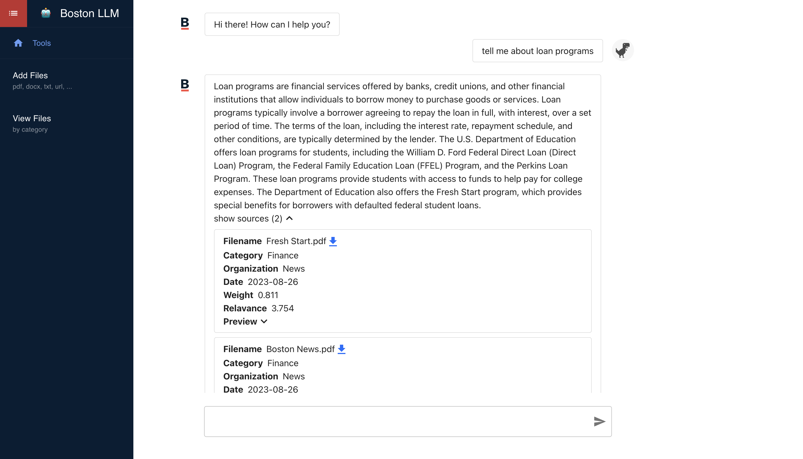
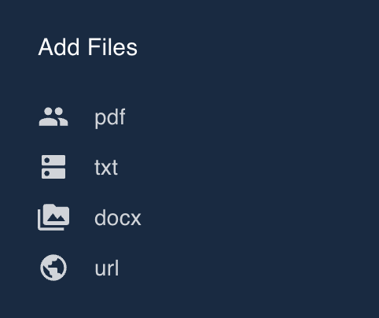
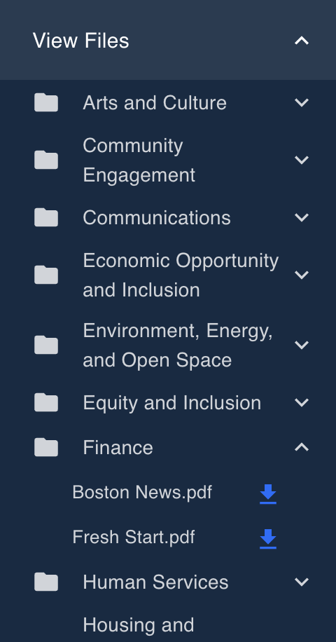
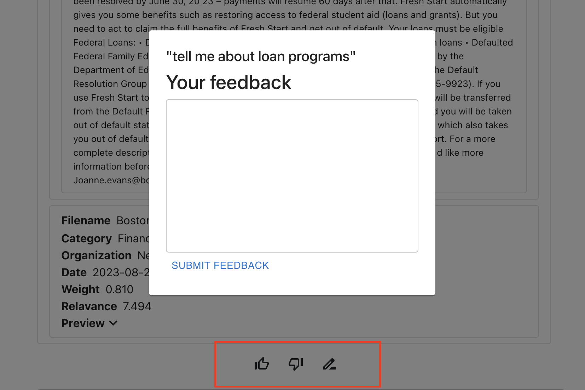
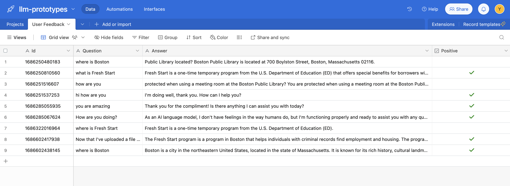

# LLM Prototypes

The current prototype is a retrieval-based conversational chatbot. We aim to create a chatbot for internal use to help government workers answer public inquiries from Boston residents. To achieve this, we customized the knowledge base of OpenAI’s LLM with hierarchical multi-format data from Boston gov, using LlamaIndex within LangChain. The current iteration of the model is able to give human language responses based on relevant source files retrieved from its knowledge base. It is able to give quantified scores to measure the relevance of sources files and the accuracy of its response. 

This repo contains the client and server side code. The web app provides real-time chatting with the chatbot as well as a frontend from uploading/viewing files in the model's current knowledge base. The frontend of the app is a React app. The backend of the app uses Flask and makes significant use of tools like LlamaIndex, mainly for data processing and connecting to vector store. The data store is composed of Azure Blob Storage (stores files and enables quick lookup/download), Azure Cognitive Search (stores files as well as metadata in vector form to enable integration with LLM), and Airtable (scores NoSQL data such as user feedback). 

From more detailed introduction and how to install the app locally, please see github wiki.

Week 1 Progress:

- [x]  On top of the current implementation in Flask, make sure the model runs with multiple file inputs, and potentially with file input of different formats.
- [x]  Build the client side of the application in React, including a real-time chatbot response and moving dots indicating response is generating
- [x]  Explore the use of roles and contexts
    - By helping user create structured queries, the responses may become more accurate
    - user is not allowed to become a GPT freerider by telling bot to “forget about everything and answer this”

Week 2 Progress:

- [x] Implement user feedback system (thumb up/down) on the client side; feedback data, including the current question and chatbot response, are instantly sent to Airtable for analysis.
- [x] Read documentation for langchain, migrate the llamaindex query engine to a langchain agent framework; currently the agent's toolkit only contains llamaindex
- [x] Build frontend file upload portal
- [x] Receive uploaded file on the backend
- [x]  Improve styling of components using Bootstrap or CSS

Week 3 Progress:

- [x] Fix file upload problem by adding storage context so files persist through uploads and is dynamically integrated to llamaindex's indices without the need to restart the server
- [x] Add two more tools to the toolkit: serpapi web search tool and ChatGPT plugin
- [x] Integrate Pinecone vector store
- [x] Refactor code to reflect a clearer code structure; add comments and improve documentations

Week 4 Progress:

- [x] Return all thought process on the frontend
- [x] Explore the potential for text retrieval: return original source text to provide more transparency
- [x] Add metadata about each file for more accurate and efficient indexing
- [x] Expand current data sources: web scrapping

Week 5 Progress:

- [x] Rewire the system to a single language model instead of agent with multiple tools, skip all thought process
- [x] Implement user feedback popup window and connect to Airtable
- [x] Create Doc Store table in Airtable to store all source files
- [x] Add a route to get all current files
- [x] Start on side project: browser extension that queries current web page content

Week 6 & 7 Progress:

- [x] Implement frontend file card to show source files and metadata
- [x] Support url upload: load data from url, break down to nodes, and send to backend
- [x] Change file storage from Pinecone to Azure Cognitive Search
- [x] Add frontend to show all files under each category
- [x] Work on side project while waiting for Azure access

Week 8 Progress:

- [x] Figure out a way to circumvent Azure's pay wall by generating response based on retrieved files only
- [x] Rewrite the entire backend script for a clearer code organization
- [x] Add routes for checking if an index exists in Cognitive, if doesn't create new index
- [x] Streamline the file processing workflow: store to blob, break down to nodes, store to search index
- [x] Simplify blob storage by using a single container

Week 9 Progress:

- [x] Get confidence and relevance score to quantify the accuracy of LLM response
- [x] Break vectors into nodes with fixed length to avoid loader bug with large-size files
- [x] Add metadata fields to Cognitive Search so considerations can be made with regard to metadata when retrieving relevant files
- [x] Pretiffy frontend, redesign sidebar
- [x] Move the responsibility of file filtering by category from blob storage to cognitive search, since blobs are no longer organized by categories

Week 10 Progress:

- [x] Fix file upload window resizing bug
- [x] Prune unnecessary dependencies
- [x] Add customizables and refactor frontend files
- [ ] Finish wiki
- [ ] Finalize report

